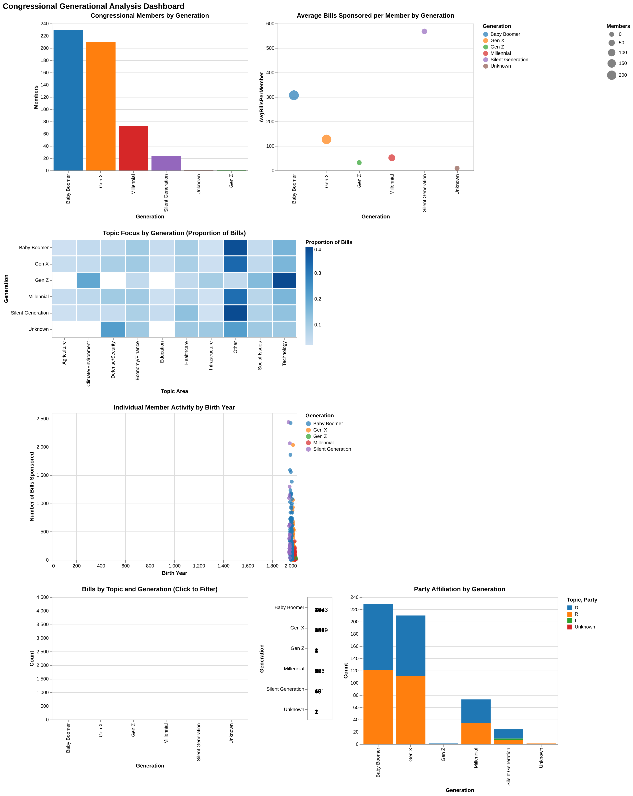

# Congressional Generational Analysis

Interactive visualizations of the 119th US Congress, analyzing legislative activity by generation, party, and geography.



## Findings & live demos

- **Congress is still a Boomer/Gen X institution** — the two generations hold ~440 of 535 seats; Millennials (~73) and Gen Z (single digits) remain a small minority.
- **The Silent Generation punches far above its weight in output**, sponsoring the most bills per member (~570 avg) of any generation.
- **Topic focus shifts visibly by generation** — Gen Z's sponsored bills skew hardest toward Technology, while older cohorts spread across Economy/Finance and Healthcare.

Every visualization is live — no cloning required:

| Demo | Link |
|---|---|
| Generational dashboard | [view](https://colinfrishberg.com/democracy-decoded/visualizations/congress_generational_dashboard.html) |
| District map | [view](https://colinfrishberg.com/democracy-decoded/visualizations/congress_district_map.html) |
| Dual-chamber state map | [view](https://colinfrishberg.com/democracy-decoded/visualizations/congress_state_map_dual_chamber.html) |
| Bill tracker | [view](https://colinfrishberg.com/democracy-decoded/visualizations/congress_bill_tracker.html) |
| Party-loyalty ranking | [view](https://colinfrishberg.com/democracy-decoded/visualizations/congress_loyalty_rank.html) |
| Loyalty distribution | [view](https://colinfrishberg.com/democracy-decoded/visualizations/loyalty_distribution.html) |
| Topic heatmap | [view](https://colinfrishberg.com/democracy-decoded/visualizations/topic_heatmap.html) |
| Member activity scatter (interactive) | [view](https://colinfrishberg.com/democracy-decoded/visualizations/member_activity_scatter_interactive.html) |

(Plus five more in [`visualizations/`](visualizations/).)

## Quick Start

### Prerequisites

- Python 3.8+
- Congress.gov API key ([get one here](https://api.congress.gov/sign-up/))

### Setup

1. **Clone the repository**
```bash

git clone https://github.com/cpfrish/democracy-decoded.git
cd democracy-decoded
```

2. **Install dependencies**

```bash

pip install -r requirements.txt
```

3. **Set your API key**
```bash
export CONGRESS_API_KEY='your_api_key_here'
```

### Generate Everything

Run all three steps at once:
```bash
python run_all.py
```

Or run steps individually:

**Step 1: Fetch member data (~2 minutes)**
```bash
python 1_fetch_member_data.py
```

**Step 2: Fetch location data (~2 minutes)**
```bash
python 2_fetch_location_data.py
```

**Step 3: Create visualizations (instant)**
```bash
python 3_create_visualizations.py
```

**Step 4 (Optional): Fetch bill data & create tracker (~5-10 minutes)**
```bash
python scripts/congress_bill_fetcher_bulk.py
python 4_create_bill_tracker.py
```

## What Gets Created

### Data Files (in `data/`)

- `congress_individual_members.csv` - All members with basic info
- `congress_generational_summary.csv` - Summary by generation
- `congress_members_with_photos.csv` - Members with photo URLs
- `congress_members_all_chambers.csv` - All members with state/district/chamber
- `congress_members_districts.csv` - House members only

### Visualizations (in `visualizations/`)

- `member_activity_scatter_interactive.html` - Interactive scatter plot
  - Bills sponsored vs birth year
  - Photo thumbnails on hover
  - Toggle between generation/party colors
  
- `congress_map_dual_chamber.html` - Interactive choropleth map
  - Toggle between House and Senate views
  - House: 435 districts colored by party
  - Senate: 50 states showing both senators
  - Photo thumbnails on hover

- `congress_bill_tracker.html` - Bill status tracker dashboard (optional)
  - Bills by tracker status (Introduced, Passed House/Senate, Became Law, etc.)
  - Bills by type (HR, S, HJRES, etc.)
  - Top 20 policy areas
  - Searchable table with filters
  - Links to full text on Congress.gov

## Project Structure

```
.
├── 1_fetch_member_data.py         # Step 1: Get member data
├── 2_fetch_location_data.py       # Step 2: Get state/district/chamber
├── 3_create_visualizations.py     # Step 3: Generate HTML visualizations
├── 4_create_bill_tracker.py       # Step 4: Generate bill tracker visualization
├── run_all.py                     # Run all steps at once
├── requirements.txt               # Python dependencies
├── data/                          # Generated CSV files (git-ignored)
├── visualizations/                # Generated HTML files
├── scripts/                       # Helper modules
│   ├── congress_api_client.py
│   ├── congress_photo_fetcher.py
│   └── congress_bill_fetcher_bulk.py
└── notebooks/                     # Jupyter notebooks for exploration
    ├── congress_eda.ipynb
    └── congress_graphs.ipynb
```

## Key Features

✅ **Photo Tooltips** - Hover over any data point or map region to see representative photos and details  
✅ **Interactive Maps** - Toggle between House districts and Senate states  
✅ **Party Color Coding** - Democrat (blue), Republican (red), Independent (purple)  
✅ **Generation Analysis** - Track legislative activity across generations  
 

## Technologies Used

- **Data**: Congress.gov API, Pandas
- **Visualizations**: D3.js, TopoJSON
- **Maps**: US Census Bureau cartographic boundaries

## API Rate Limits

The Congress.gov API has rate limits. The scripts include automatic delays (0.25s between requests) to comply with these limits. Full data fetching takes approximately 4-5 minutes total.

## Caching

Data files are cached in the `data/` directory. To refresh with new data, simply delete the CSV files and re-run the scripts.


### Notebooks

Jupyter notebooks for data exploration are in the `notebooks/` directory:
```bash
jupyter notebook notebooks/congress_eda.ipynb
```

### Scripts

Helper modules are in `scripts/`:
- `congress_api_client.py` - API interaction functions
- `congress_photo_fetcher.py` - Photo URL fetching and processing

## Contributing

This project was developed as part of UC Berkeley's I School Data Science program.

## License

Data sourced from Congress.gov (public domain). Visualizations and code are available for educational use.

## Credits

- **Data Source**: Congress.gov API
- **Geographic Data**: US Census Bureau via us-atlas
- **Official Photos**: bioguide.congress.gov

---

**Questions?** Check the documentation files
